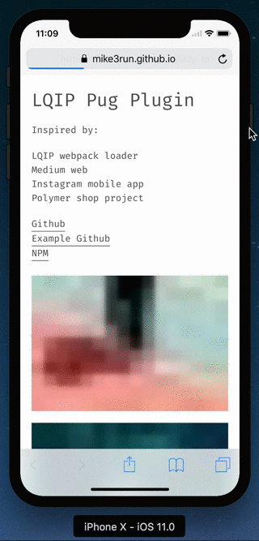

# lqip-pug

[](https://badge.fury.io/js/lqip-pug)
[](https://standardjs.com)

My take on low quality image placehoder for pug static builds

The basic idea implies combining this with something like [lazysizes](https://github.com/aFarkas/lazysizes) to have everything lazy loaded while giving something to see to the user while that loads.

[Live Demo](https://mike3run.github.io/lazy-example/)



## Setup
The main idea is to abstract everything in a mixin for ease of use.
Here are shown the defaults the component has:

`gulpfile.js`

```js
const gulp = require('gulp')
const pug = require('gulp-pug')

const BlurryPug = require('lqip-pug')
const blurry = new BlurryPug({
  // directory where your source images live must be an absolute path
  baseDir: process.cwd(),
  // compiled blurry image width size in pixels
  size: 16,
  // the compiled path of the image aka where the hosted real image lives
  compiledPath: 'img',
  // a function that will render the template for your mixins
  template: (presrc, src) => ``
})

gulp.task('pug', () =>
  gulp.src('./*/**.pug')
  .pipe(pug({
    locals: {blur: name => blurry.blur(name)}
  }))
  .pipe(gulp.dest('./public'))
)
```

Now on your pug files create a mixin like this:

`mixins.pug`

```pug
mixin img(name)
  !=blur(name)
```

and use it like this:

`index.pug`

```pug
+img('tenis.jpg')
```

You'll get something like this after compile:

```html

```

Smile you have made your site much more performant.

## Credits
* [lqip-loader](https://github.com/zouhir/lqip-loader) for the inspiration
* Example picture by Ben O'Sullivan on Unsplash
